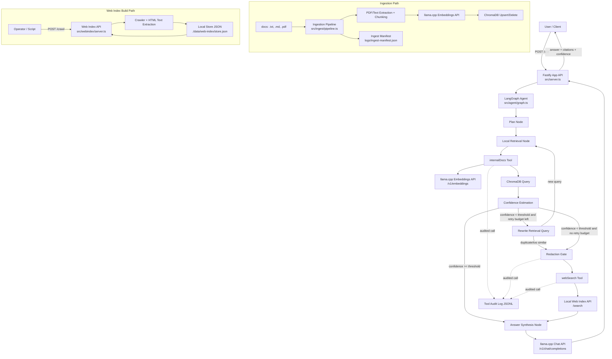

# Application Architecture

## Overview

This project is a **local-first agentic RAG system** written in TypeScript. It answers user questions by prioritizing internal document retrieval from ChromaDB, running a bounded local query-rewrite retry when confidence is low, and falling back to a local web index only if local evidence is still insufficient.

The project was done mainly to create an app, able to run on a basic 32GB RAM CPU machine, while offering all possible advancements of agentic information retrieval. 

The architecture is split into two main runtime paths:

1. **Query path**: user asks a question through the app API (`/ask`), LangGraph orchestrates retrieval and answer synthesis.
2. **Ingestion/indexing path**: local files are chunked and embedded into Chroma; web pages are crawled and indexed into a local JSON store.

The system enforces privacy defaults:

- localhost-only service endpoints
- telemetry/tracing disabled by default
- redaction gate before web search fallback
- audited tool calls in local JSONL logs

## CPU-only Operation (Disable GPU Offload)

This project is designed to run on CPU-only machines. You do not need to disable the GPU in BIOS/OS.

To force llama.cpp CPU-only execution, add this flag when starting both chat and embeddings servers:

- `--n-gpu-layers 0`

Apply it in the service start commands from `installation_and_use.md` sections `4.2` and `4.3`.

## Core Functionality

- Accepts user question via HTTP `POST /ask`.
- Plans and routes query through a LangGraph state machine.
- Retrieves internal evidence using:
  - query embedding from local llama.cpp embeddings API
  - vector similarity search in ChromaDB
- Performs a bounded local retrieval retry with a rewritten query (non-duplicate enforcement).
- Estimates retrieval confidence and decides whether web fallback is needed.
- Applies redaction rules before externalized web queries.
- Queries local web-index service for web evidence when needed (web-index service connection is yet to be done)
- Compacts evidence (item cap + snippet cap + char budget) before synthesis.
- Generates final answer with local llama.cpp chat completion API.
- Returns answer with confidence and citations.

## Main Components

- **API server (`src/server.ts`)**
  - Fastify endpoint for `/ask`
  - Input validation via Zod
  - Executes `runAgent()` and formats response
- **Agent graph (`src/agent/graph.ts`)**
  - LangGraph nodes: `plan -> local -> (rewrite -> local) -> (redact -> web) -> answer`
  - Routing decisions based on `localConfidence`, retry budget, and duplicate-query guard
- **Internal docs tool (`src/tools/internalDocs.ts`)**
  - Embeds query via llama embeddings endpoint
  - Queries Chroma collection and maps results to evidence objects
- **Web search tool (`src/tools/webSearch.ts`)**
  - Calls local web-index `/search`
  - Uses audited execution and redaction flag
- **Redaction gate (`src/tools/redactionGate.ts`)**
  - Masks emails, secrets, IDs, hostnames, and path-like data
- **Audit logger (`src/tools/auditLogger.ts`)**
  - Logs hashed inputs/outputs, durations, status, and redaction metadata
- **Ingestion pipeline (`src/ingest/pipeline.ts`)**
  - Scans `.txt/.md/.pdf`, extracts text, chunks, embeds, upserts to Chroma
  - Maintains delta manifest to skip unchanged docs and delete stale chunks
- **Web index service (`src/webindex/server.ts`)**
  - `/crawl` to fetch and store pages
  - `/search` to retrieve lexical matches from local store

## Data Storage and External Services

- **ChromaDB**: vector store for internal doc chunks and embeddings.
- **llama.cpp chat server**: answer synthesis.
- **llama.cpp embeddings server**: embedding generation for ingestion and retrieval.
- **Web index store (`data/web-index/store.json`)**: crawled web docs (local JSON file).
- **Ingest manifest (`logs/ingest-manifest.json`)**: content hashes + chunk counts for delta ingestion.
- **Tool audit log (`logs/tool-calls.jsonl`)**: per-tool execution audit trail.

## Libraries Used

### Runtime and API

- `fastify`: HTTP server for app API and web-index API.
- `zod`: request and environment schema validation.
- `dotenv`: environment variable loading.

### Agent orchestration and AI integration

- `@langchain/langgraph`: state graph orchestration for agent workflow.
- `@langchain/core`: shared LangChain primitives.

### Retrieval and document processing

- `chromadb`: Chroma client for vector upsert/query/delete.
- `pdf-parse`: PDF text extraction for ingestion.

### Tooling and development

- `typescript`: static typing and build output.
- `tsx`: TypeScript execution for dev scripts/tests.
- `@types/node`: Node.js type definitions.

## Component Interaction Diagram

## Request Lifecycle (High Level)

1. Client sends question to app API or type a prompt in the UI chat.
2. Agent retrieves local evidence from Chroma using embedded query.
3. Agent computes confidence:
   - if high enough, answer from local evidence
   - if low and retry budget remains, rewrite retrieval query and run one more local retrieval pass
   - rewritten query is rejected if duplicate/too similar to prior retrieval attempts
4. If local confidence is still low after retry budget, agent redacts query and retrieves supplemental web evidence from local web index.
5. Agent compacts evidence into bounded prompt context.
6. llama.cpp chat endpoint synthesizes final response.
7. API or UI returns answer with evidence-derived citation metadata.

## Privacy / Security Defaults

- Local services must bind to `127.0.0.1` only.
- Telemetry and remote tracing are disabled by default.
- Internal docs tool and web search tool are fully separated.
- Redaction gate runs before external web calls.
- Every tool invocation is logged to local JSONL.
- Evidence payload is compacted with a strict char budget before LLM synthesis.

## Built-in UI (Static JS)

This project now ships with a lightweight built-in web UI at:

- `http://127.0.0.1:8080/`

Why static JS (instead of Streamlit):

- lower memory footprint (no Python runtime + Streamlit server)
- lower idle CPU usage for always-on local usage
- direct reuse of existing Fastify APIs and TypeScript code
- simpler deploy and fewer moving parts

What the UI supports:

- vectorize any local folder by path (server-side ingestion)
- list vectorized documents and grouped folders (from ingest manifest)
- ask questions in chat
- view chat history
- choose follow-up mode (augments question with prior session context) or start a new chat

## Citation Metadata

Internal-document citations include enriched metadata when available:

- document name (`documentName`)
- document path (`documentPath`)
- chapter/subchapter path (`chapterPath`)
- page range (`pageStart`/`pageEnd`) for PDFs when page boundaries can be inferred

## Context Budget Controls

- `MAX_LOCAL_RETRIEVAL_PASSES`: maximum local retrieval attempts per user question (includes first pass).
- `MAX_EVIDENCE_ITEMS`: hard cap on retrieved evidence rows passed to synthesis.
- `MAX_EVIDENCE_SNIPPET_CHARS`: per-evidence snippet truncation limit.
- `EVIDENCE_CHAR_BUDGET`: total character budget for rendered evidence block.
